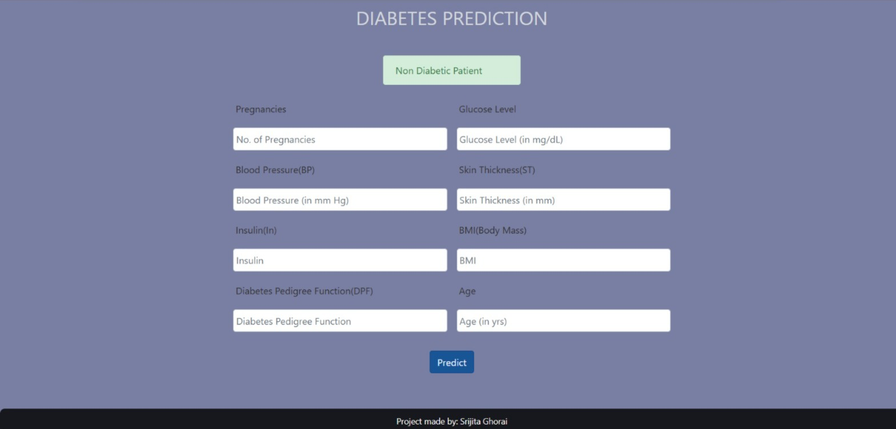

# Diabetes Prediction

This repository contains a machine learning model designed to predict the likelihood of diabetes in patients based on various medical attributes. The model leverages historical data to help healthcare providers in early detection and management of diabetes.

## Overview

The goal of this project is to predict whether a patient has diabetes or not based on medical information such as age, BMI, blood pressure, insulin levels, etc. The model is built using machine learning algorithms such as Logistic Regression, Random Forest, or Support Vector Machine (SVM).

## Dataset

The dataset used for this project is sourced from the [Pima Indians Diabetes Database](https://www.kaggle.com/datasets/uciml/pima-indians-diabetes-database), which contains the following attributes:

1. **Pregnancies**: Number of times pregnant
2. **Glucose**: Plasma glucose concentration
3. **BloodPressure**: Diastolic blood pressure (mm Hg)
4. **SkinThickness**: Skinfold thickness (mm)
5. **Insulin**: 2-Hour serum insulin (mu U/ml)
6. **BMI**: Body mass index (weight in kg/(height in m)^2)
7. **DiabetesPedigreeFunction**: Diabetes pedigree function
8. **Age**: Age of the patient (years)
9. **Outcome**: 1 if the patient has diabetes, 0 otherwise

## Model

The following machine learning algorithms are used in this project:

- **Logistic Regression**
- **K Neighbours Classifier**
- **Naive Bayes Classifier**
- **Random Forest**
- **Support Vector Machine (SVM)**
- **Decision Tree**

The model's performance is evaluated based on accuracy and other classification metrics.
## Usage

1. Loading the dataset:
   - The dataset can be loaded directly from a `diabetes.csv` file using Pandas.
   
2. Preprocessing the data:
   - Handling missing values, normalizing/scaling the data, and splitting it into training and testing sets.
   
3. Training the model:
   - Using machine learning models such as Logistic Regression, Random Forest, or SVM to train on the dataset.
   
4. Evaluating the model:
   - Checking the performance of the model using metrics like accuracy, precision, recall, and F1-score.

5. Make Predictions:
   - After training the model, I have used it to predict the diabetes status for new data.

## Results
The model achieved an accuracy of 98% on the test dataset. 
